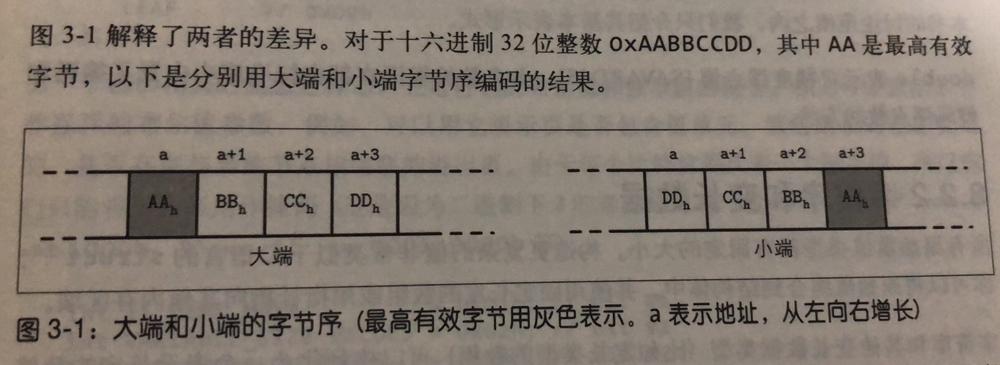

# 文件系统

> 小结: B 树认为是磁盘页的管理机制， B 树的平衡算法需要组合页并在页中移动。需要计算页和指向它们的指针并将它们放在相应的位置。（磁盘数据结构的管理和内存中的有所不同，磁盘中的数据结构操作的是磁盘页，内存中的操作的是字节地址。）

内存数据结构可以利用 CPU 缓存行，预取或者其他硬件相关的特性，用来达到某些优化的目的。实现磁盘数据结构需要关注的东西比内存数据结构多得多。磁盘数据结构必须要自己处理垃圾和碎片的问题。

## 关注的问题 1  
 如何以二进制的形式表示键和数据记录， 如何将多个值组合成更加复杂的结构， 以及如何实现可变长度的数据类型和数组？
 

首先， 键和值都具有某种类型， 比如 integer(整形) 和 string (字符串类型) 都具有可以表示成为二进制形式表示(序列化为二进制和从二进制的形式反序列化)。 
大多数数值类型都用固定大小的值来表示。 当处理多字节数值时， 务必在编解码时使用相同的字节序(byte-order 或者 endianness), 字节序决定了一组字节的先后顺序。

字节序： 
** 大端系统: 
从最高的有效字节开始， 从高位到地位依次排序。 也就是， 最高位有效字节具有最低效地址。
** 小端系统:  
从最低有效地址开始， 从低位到高位依次排序。

 
 数据在内存中的布局和在磁盘中的布局之间的不同: 数据在磁盘中需要考虑数据的存储， 比如使用的是大小端存储。
 