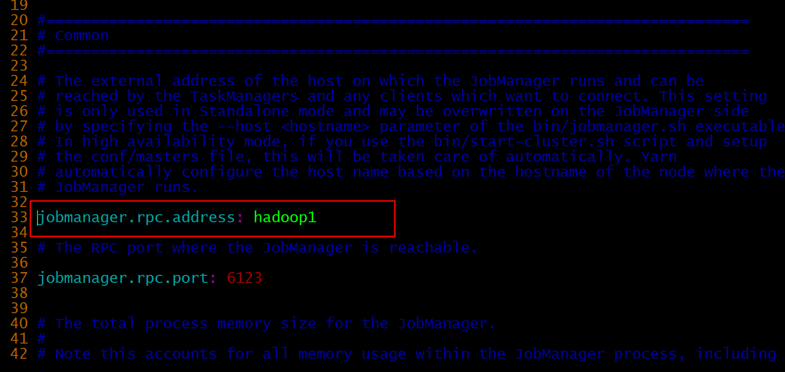
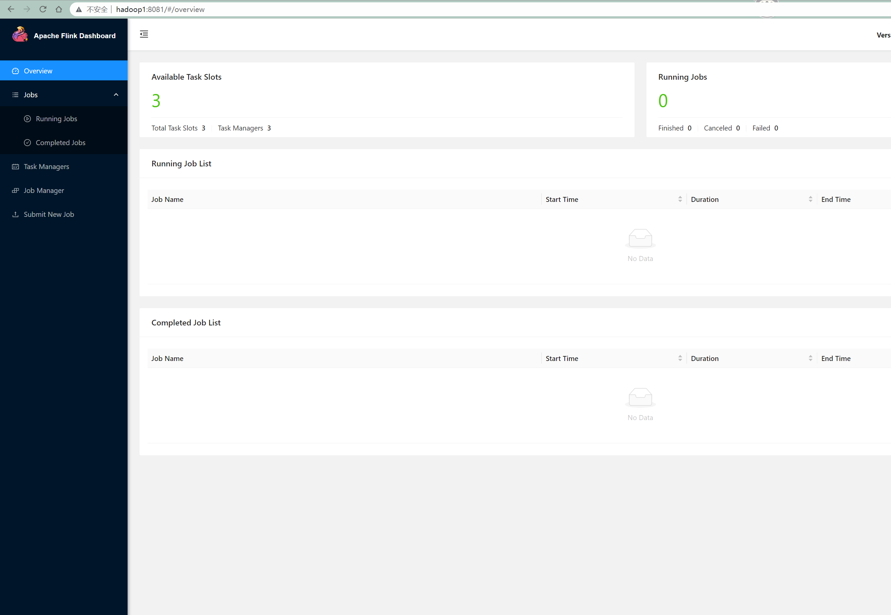
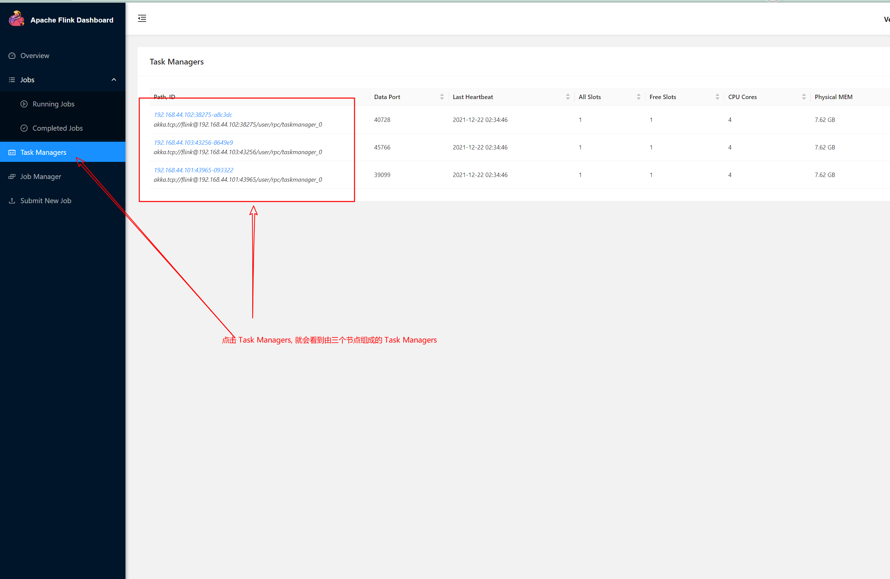

# standalone 集群搭建


## 资源准备

1. 三台 centos 7 集群组成的集群
2. 下载 [flink 安装包](https://archive.apache.org/dist/flink/flink-1.11.4/flink-1.11.4-bin-scala_2.11.tgz)
3. java8 及以上的环境

### 主机网络配置

### hadoop1 节点网络配置

> vim /etc/sysconfig/network-scripts/ifcfg-ens33

```shell
TYPE="Ethernet"
PROXY_METHOD="none"
BROWSER_ONLY="no"
# BOOTPROTO="dhcp"
BOOTPROTO="static"
DEFROUTE="yes"
IPV4_FAILURE_FATAL="no"
IPV6INIT="yes"
IPV6_AUTOCONF="yes"
IPV6_DEFROUTE="yes"
IPV6_FAILURE_FATAL="no"
IPV6_ADDR_GEN_MODE="stable-privacy"
NAME="ens33"
UUID="7192fe8d-684f-49ef-a12b-b4c512edc2c2"
DEVICE="ens33"
ONBOOT="yes"
IPV6_PRIVACY="no"
IPADDR="192.168.44.101"
NETMASK="255.255.255.0"
GATEWAY="192.168.44.254"
DNS1="114.114.114.114"                                              
```

### hadoop2 节点网络配置

> vim /etc/sysconfig/network-scripts/ifcfg-ens33

```shell
TYPE="Ethernet"
PROXY_METHOD="none"
BROWSER_ONLY="no"
# BOOTPROTO="dhcp"
BOOTPROTO="static"
DEFROUTE="yes"
IPV4_FAILURE_FATAL="no"
IPV6INIT="yes"
IPV6_AUTOCONF="yes"
IPV6_DEFROUTE="yes"
IPV6_FAILURE_FATAL="no"
IPV6_ADDR_GEN_MODE="stable-privacy"
NAME="ens33"
UUID="7192fe8d-684f-49ef-a12b-b4c512edc2c2"
DEVICE="ens33"
ONBOOT="yes"
IPV6_PRIVACY="no"
IPADDR="192.168.44.102"
NETMASK="255.255.255.0"
GATEWAY="192.168.44.254"
DNS1="114.114.114.114"                                              
```

### hadoop3 节点网络配置

> vim /etc/sysconfig/network-scripts/ifcfg-ens33

```shell
TYPE="Ethernet"
PROXY_METHOD="none"
BROWSER_ONLY="no"
# BOOTPROTO="dhcp"
BOOTPROTO="static"
DEFROUTE="yes"
IPV4_FAILURE_FATAL="no"
IPV6INIT="yes"
IPV6_AUTOCONF="yes"
IPV6_DEFROUTE="yes"
IPV6_FAILURE_FATAL="no"
IPV6_ADDR_GEN_MODE="stable-privacy"
NAME="ens33"
UUID="7192fe8d-684f-49ef-a12b-b4c512edc2c2"
DEVICE="ens33"
ONBOOT="yes"
IPV6_PRIVACY="no"
IPADDR="192.168.44.103"
NETMASK="255.255.255.0"
GATEWAY="192.168.44.254"
DNS1="114.114.114.114"                                              
```

### 三个节点的 `/etc/hosts` 文件配置

 在最后面加入三行

```shell
192.168.44.101  hadoop1  # hadoop 节点 1
192.168.44.102  hadoop2  # hadoop 节点 2
192.168.44.103  hadoop3  # hadoop 节点 3
```


##  flink 环境配置

flink 环境配置(这里没有 jdk环境的配置)

(以hadoop1: 三台机器中一一台为例子)

```shell
# 解压并命名
wget https://archive.apache.org/dist/flink/flink-1.11.4/flink-1.11.4-bin-scala_2.11.tgz
tar -zxvf flink-1.11.4-bin-scala_2.11.tgz
mv flink-1.11.4-bin-scala_2.11 flink 
cp /etc/profile /etc/profile.bak
 
 # 配置 flink 环境
 echo "#flink 环境配置" >> /etc/profile
 echo "export FLINK_HOME=$(pwd)/flink" >> /etc/profile
 echo "PATH=$PATH:$FLINK_HOME" >> /etc/profile
 
 # 使 flink 环境生效
 source /etc/profile 
 
 # 验证安装是否生效
 flink --version # 打印 flink 的版本信息
```

这个操作同步到其他的两个节点

## 修改 flink 的启动配置，master 文件以及增加 slaves 文件

### 修改 flink-conf.yml 文件

```shell
# 备份原来的配置文件
cp $FLINK_HOME/conf/flink-conf.yaml $FLINK_HOME/conf/flink-conf.yaml.bak

# 修改 flink 的配置文件
vim  $FLINK_HOME/conf/flink-conf.yaml
```

修改这一行, <span style="color:red;font-size:20px">`jobmanager.rpc.address: hadoop1`</span>  其中 hadoop1 是主机的 hostname, 这里修改成为你自己的主机就好了



### 修改 masters 文件

```shell
# 备份原来的配置文件
cp $FLINK_HOME/conf/masters  $FLINK_HOME/conf/masters.bak
# 用 hadoop1:8081 替换原来的内容 
 echo "hadoop1:8081" > $FLINK_HOME/conf/masters 
```

### 增加 slaves 文件

```shell
echo "hadoop2" > $FLINK_HOME/conf/slaves
echo "hadoop3" >> $FLINK_HOME/conf/slaves
```


**将上面的操作同步到其他两台主机或者到两台主机上进行相同的操作**


## 启动 flink 集群

在 hadoop1 节点上执行启动 flink 的操作

```shell
/bin/bash $FLINK_HOME/bin/start-cluster.sh
```

**这一步， 可能需要到其他的两个节点上执行相同的命令**

启动成功的话， 打开 [flink dashboard](http://hadoop1:8081) 



会看到这个页面， 怎么验证集群已经启动成功了呢？ 




## 排错参考

1. 集群组网不成功，看了是否是防火墙的原因

   